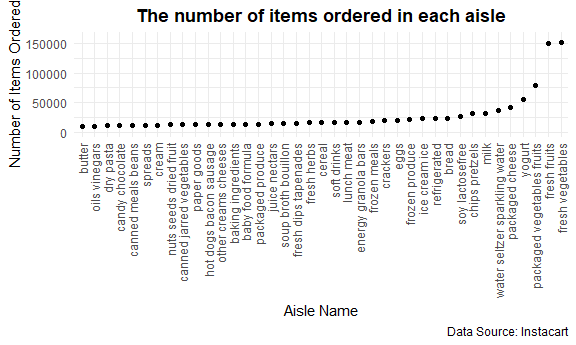

P8105 Homework 3
================
Kyung Suk Lee
2020-10-10

  - [Problem 1](#problem-1)
      - [1-1) Write a short description of the
        dataset](#write-a-short-description-of-the-dataset)
      - [1-2) How many aisles are there, and which aisles are the most
        items ordered
        from?](#how-many-aisles-are-there-and-which-aisles-are-the-most-items-ordered-from)
      - [1-3) Make a plot that shows the number of items ordered in each
        aisle](#make-a-plot-that-shows-the-number-of-items-ordered-in-each-aisle)
      - [1-4) Make a table showing the three most popular
        items](#make-a-table-showing-the-three-most-popular-items)
      - [1-5) Make a table showing the mean hour of the
        day](#make-a-table-showing-the-mean-hour-of-the-day)
  - [Problem 2](#problem-2)
      - [2-1) Load, tidy, and otherwise wrangle the
        data](#load-tidy-and-otherwise-wrangle-the-data)
      - [2-2) Aggregate minutes and create a
        table](#aggregate-minutes-and-create-a-table)
      - [2-3) Make a single-panel plot](#make-a-single-panel-plot)
  - [Problem 3](#problem-3)
      - [3-1) For snowfall, what are the most commonly observed
        values?](#for-snowfall-what-are-the-most-commonly-observed-values)
      - [3-2) Make a two-panel plot (1)](#make-a-two-panel-plot-1)
      - [3-3) Make a two-panel plot (2)](#make-a-two-panel-plot-2)

``` r
library(tidyverse)
library(p8105.datasets)

knitr::opts_chunk$set(
  fig.width = 6,
  fig.asp = .6,
  out.width = "90%")

theme_set(theme_minimal() + theme(legend.position = "bottom"))

options(
  ggplot2.continuous.colour="viridis",
  ggplot2.continuous.fill="viridis")

scale_colour_discrete = scale_color_viridis_d
scale_fill_discrete = scale_fill_viridis_d

knitr::opts_chunk$set(comment = NA, message = F, warning = F, echo = T)
```

## Problem 1

### 1-1) Write a short description of the dataset

``` r
data("instacart")
head(instacart)
```

    # A tibble: 6 x 15
      order_id product_id add_to_cart_ord~ reordered user_id eval_set order_number
         <int>      <int>            <int>     <int>   <int> <chr>           <int>
    1        1      49302                1         1  112108 train               4
    2        1      11109                2         1  112108 train               4
    3        1      10246                3         0  112108 train               4
    4        1      49683                4         0  112108 train               4
    5        1      43633                5         1  112108 train               4
    6        1      13176                6         0  112108 train               4
    # ... with 8 more variables: order_dow <int>, order_hour_of_day <int>,
    #   days_since_prior_order <int>, product_name <chr>, aisle_id <int>,
    #   department_id <int>, aisle <chr>, department <chr>

  - Some description about the *instacart* dataset<br/> *Instacart* is
    an anonymized dataset with over 3 million online grocery orders from
    more than 200,000 *Instacart* users. This dataset contains
    **1384617** rows and **15** columns. Observations are the level of
    items in orders by user. There are *order\_id, product\_id,
    add\_to\_cart\_order, reordered, user\_id, eval\_set, order\_number,
    order\_dow, order\_hour\_of\_day, days\_since\_prior\_order,
    product\_name, aisle\_id, department\_id, aisle, department*
    variables. For some of key variables, the dataset provides
    information with **131209** unique orders and **39123** unique
    products with **21** departments which the products belong to.<br/>

### 1-2) How many aisles are there, and which aisles are the most items ordered from?

``` r
# Number of aisles
# Aisles with the most items ordered from

instacart %>% 
  janitor::clean_names() %>%
  count(aisle, name = "number_of_aisles") %>% 
  arrange(desc(number_of_aisles))
```

    # A tibble: 134 x 2
       aisle                         number_of_aisles
       <chr>                                    <int>
     1 fresh vegetables                        150609
     2 fresh fruits                            150473
     3 packaged vegetables fruits               78493
     4 yogurt                                   55240
     5 packaged cheese                          41699
     6 water seltzer sparkling water            36617
     7 milk                                     32644
     8 chips pretzels                           31269
     9 soy lactosefree                          26240
    10 bread                                    23635
    # ... with 124 more rows

  - Some comment on the result<br/> There are **134** aisles and *fresh
    vegetables* is the most item ordered from with **150609**
    orders.<br/>

### 1-3) Make a plot that shows the number of items ordered in each aisle

``` r
# Make a plot that shows the number of items ordered in each aisle
# Limiting this to aisles with more than 10000 items ordered
# Arrange aisles sensibly, and organize your plot

instacart %>% 
  janitor::clean_names() %>% 
  count(aisle, name = "number_of_aisles") %>% 
  filter(number_of_aisles > 10000) %>% 
  mutate(
    aisle = factor(aisle),
    aisle = fct_reorder(aisle, number_of_aisles)
  ) %>% 
  ggplot(aes(x = aisle, y = number_of_aisles)) +
  geom_point() +
  theme(axis.text.x = element_text(angle = 90, vjust = 0.5, hjust = 1)) +
  theme(axis.text.y = element_text(vjust = 0.5, hjust = 1)) +
  labs(
    title = "The number of items ordered in each aisle",
    x = "Aisle Name",
    y = "Number of Items Ordered",
    caption = "Data Source: Instacart") +
  ylim(0, 160000)
```



### 1-4) Make a table showing the three most popular items

``` r
# Make a table showing the three most popular items in each of the aisles
# Include the number of times each item is ordered in your table

instacart %>% 
  janitor::clean_names() %>% 
  filter(aisle %in% c("baking ingredients", "dog food care", "packaged vegetables fruits")) %>% 
  group_by(aisle) %>%
  count(product_name, name = "number_of_orders") %>% 
  mutate(rank = min_rank(desc(number_of_orders))) %>% 
  filter(rank < 4) %>% 
  arrange(aisle, rank) %>% 
  knitr::kable()
```

| aisle                      | product\_name                                 | number\_of\_orders | rank |
| :------------------------- | :-------------------------------------------- | -----------------: | ---: |
| baking ingredients         | Light Brown Sugar                             |                499 |    1 |
| baking ingredients         | Pure Baking Soda                              |                387 |    2 |
| baking ingredients         | Cane Sugar                                    |                336 |    3 |
| dog food care              | Snack Sticks Chicken & Rice Recipe Dog Treats |                 30 |    1 |
| dog food care              | Organix Chicken & Brown Rice Recipe           |                 28 |    2 |
| dog food care              | Small Dog Biscuits                            |                 26 |    3 |
| packaged vegetables fruits | Organic Baby Spinach                          |               9784 |    1 |
| packaged vegetables fruits | Organic Raspberries                           |               5546 |    2 |
| packaged vegetables fruits | Organic Blueberries                           |               4966 |    3 |

### 1-5) Make a table showing the mean hour of the day

``` r
# Make a table showing the mean hour of the day at which Pink Lady Apples and Coffee Ice Cream are ordered on each day of the week
# Format this table for human readers

instacart %>% 
  janitor::clean_names() %>% 
  filter(product_name %in% c("Pink Lady Apples", "Coffee Ice Cream")) %>% 
  mutate(order_dow = recode_factor
         (order_dow,
           "0" = "sunday",
           "1" = "monday",
           "2" = "tuesday",
           "3" = "wednesday",
           "4" = "thursday",
           "5" = "friday",
           "6" = "saturday")
         ) %>%
  group_by(product_name, order_dow) %>% 
  summarize(mean_hour = mean(order_hour_of_day)) %>% 
  pivot_wider(
    names_from = order_dow,
    values_from = mean_hour
  ) %>% 
  knitr::kable()
```

| product\_name    |   sunday |   monday |  tuesday | wednesday | thursday |   friday | saturday |
| :--------------- | -------: | -------: | -------: | --------: | -------: | -------: | -------: |
| Coffee Ice Cream | 13.77419 | 14.31579 | 15.38095 |  15.31818 | 15.21739 | 12.26316 | 13.83333 |
| Pink Lady Apples | 13.44118 | 11.36000 | 11.70213 |  14.25000 | 11.55172 | 12.78431 | 11.93750 |

-----

## Problem 2

### 2-1) Load, tidy, and otherwise wrangle the data

``` r
acc_tidy_df =
  readr::read_csv("./data/accel_data.csv") %>% 
  janitor::clean_names() %>% 
  pivot_longer(
    activity_1:activity_1440,
    names_to = "activity",
    values_to = "activity_counts"
  ) %>% 
  mutate(
    activity_day = ifelse(day == "Saturday" | day == "Sunday", "weekend", "weekday")
    )

acc_tidy_df
```

    # A tibble: 50,400 x 6
        week day_id day    activity    activity_counts activity_day
       <dbl>  <dbl> <chr>  <chr>                 <dbl> <chr>       
     1     1      1 Friday activity_1             88.4 weekday     
     2     1      1 Friday activity_2             82.2 weekday     
     3     1      1 Friday activity_3             64.4 weekday     
     4     1      1 Friday activity_4             70.0 weekday     
     5     1      1 Friday activity_5             75.0 weekday     
     6     1      1 Friday activity_6             66.3 weekday     
     7     1      1 Friday activity_7             53.8 weekday     
     8     1      1 Friday activity_8             47.8 weekday     
     9     1      1 Friday activity_9             55.5 weekday     
    10     1      1 Friday activity_10            43.0 weekday     
    # ... with 50,390 more rows

  - Some description of *accel\_data* dataset<br/> The initial
    *accel\_data* dataset comprised of *activity.\#* variables, which
    are the activity counts for each minute of a 24-hour day starting at
    midnight. This dataset was difficult for further analysis since all
    the *activity.\#* variables were shown as **1443** columns with
    **35** rows. Thus, I have transformed the data using `pivot_longer`
    in order to separate *activity* and *activity\_counts*. Next, I have
    added an additional column, *activity\_day*, to indicate whether the
    day was weekend or weekday. The tidy version of the dataset has the
    size of **6** columns and **50400** rows and comprises of week,
    day\_id, day, activity, activity\_counts, activity\_day variables. I
    didn’t find the need for encoding the variable classes, since all
    the variables already had reasonable variable classes (e.g., chr and
    dbl).<br/>

### 2-2) Aggregate minutes and create a table

``` r
acc_tidy_df %>% 
  group_by(week, day, activity_day) %>% 
  summarize(total_activiy_counts = sum(activity_counts)) %>% 
  knitr::kable()
```

| week | day       | activity\_day | total\_activiy\_counts |
| ---: | :-------- | :------------ | ---------------------: |
|    1 | Friday    | weekday       |              480542.62 |
|    1 | Monday    | weekday       |               78828.07 |
|    1 | Saturday  | weekend       |              376254.00 |
|    1 | Sunday    | weekend       |              631105.00 |
|    1 | Thursday  | weekday       |              355923.64 |
|    1 | Tuesday   | weekday       |              307094.24 |
|    1 | Wednesday | weekday       |              340115.01 |
|    2 | Friday    | weekday       |              568839.00 |
|    2 | Monday    | weekday       |              295431.00 |
|    2 | Saturday  | weekend       |              607175.00 |
|    2 | Sunday    | weekend       |              422018.00 |
|    2 | Thursday  | weekday       |              474048.00 |
|    2 | Tuesday   | weekday       |              423245.00 |
|    2 | Wednesday | weekday       |              440962.00 |
|    3 | Friday    | weekday       |              467420.00 |
|    3 | Monday    | weekday       |              685910.00 |
|    3 | Saturday  | weekend       |              382928.00 |
|    3 | Sunday    | weekend       |              467052.00 |
|    3 | Thursday  | weekday       |              371230.00 |
|    3 | Tuesday   | weekday       |              381507.00 |
|    3 | Wednesday | weekday       |              468869.00 |
|    4 | Friday    | weekday       |              154049.00 |
|    4 | Monday    | weekday       |              409450.00 |
|    4 | Saturday  | weekend       |                1440.00 |
|    4 | Sunday    | weekend       |              260617.00 |
|    4 | Thursday  | weekday       |              340291.00 |
|    4 | Tuesday   | weekday       |              319568.00 |
|    4 | Wednesday | weekday       |              434460.00 |
|    5 | Friday    | weekday       |              620860.00 |
|    5 | Monday    | weekday       |              389080.00 |
|    5 | Saturday  | weekend       |                1440.00 |
|    5 | Sunday    | weekend       |              138421.00 |
|    5 | Thursday  | weekday       |              549658.00 |
|    5 | Tuesday   | weekday       |              367824.00 |
|    5 | Wednesday | weekday       |              445366.00 |

  - Some comment on the table<br/> From the table, it seems that, in
    general, there is an increasing trend of *total\_acitivity\_counts*
    on weekdays from Monday to Friday, excluding week 3 and week 4.
    Also, when I compared the mean of *total\_acitivity\_counts* between
    weekday (4.068228210^{5}) and weekend (3.2884510^{5}), it seems
    that, on average, there were more activity during the weekday
    compared to weekend.<br/>

<!-- end list -->

``` r
acc_tidy_df %>% 
  group_by(week, day, activity_day) %>% 
  summarize(total_activiy_counts = sum(activity_counts)) %>% 
  filter(activity_day == "weekend") %>% 
  pull(total_activiy_counts) %>% 
  mean()
```

    [1] 328845

### 2-3) Make a single-panel plot

``` r
acc_tidy_df %>% 
  mutate(activity = stringr::str_sub(activity, 10, 13),
         activity = as.numeric(activity)
         ) %>%  
  ggplot(aes(x = activity, y = activity_counts, color = day)) +
  geom_point(alpha = .5) +
  geom_line(alpha = .5) +
  scale_x_continuous(breaks = seq(60, 1440, by = 60), 
                     labels = c(1:24)
                     ) +
  ylim(0, 10000) +
  labs(
    title = "24-hour Activity Time Courses for Each Day",
    x = "Time (24-hour)",
    y = "Physical Activity Counts",
    caption = "Datasource: Advanced Cardiac Care Center of Columbia University Medical Center"
  )
```


-----

## Problem 3

``` r
# Write a short description of the dataset
# Note the size and structure of the data
# Describe some key variables
# Indicate the extent to which missing data is an issue

data("ny_noaa")
head(ny_noaa)
```

    # A tibble: 6 x 7
      id          date        prcp  snow  snwd tmax  tmin 
      <chr>       <date>     <int> <int> <int> <chr> <chr>
    1 US1NYAB0001 2007-11-01    NA    NA    NA <NA>  <NA> 
    2 US1NYAB0001 2007-11-02    NA    NA    NA <NA>  <NA> 
    3 US1NYAB0001 2007-11-03    NA    NA    NA <NA>  <NA> 
    4 US1NYAB0001 2007-11-04    NA    NA    NA <NA>  <NA> 
    5 US1NYAB0001 2007-11-05    NA    NA    NA <NA>  <NA> 
    6 US1NYAB0001 2007-11-06    NA    NA    NA <NA>  <NA> 

  - Some description about the *ny\_noaa* dataset<br/> This dataset
    contains information for all New York state weather stations from
    January 1, 1981 through December 31, 2010. The dataset provides
    information with *id, date, prcp, snow, snwd, tmax, tmin*. The size
    of the dataset has **7** columns and **2595176** rows. Some key
    variables include precipitation *(prcp)* in tenth of mm, snowfall
    *(snow)* in mm, snow depth *(snwd)* in mm, and both maximum *(tmax)*
    and minimum *(tmin)* temperatures in tenths of degree Celcius.<br/>

When we observe the missing values, for precipitation, **145838**
values; for snowfall *(snow)*, **381221** values; for snow depth
*(snwd)*, **591786** values; for maximum temperatures *(tmax)* ,
**1134358** values; and for minimum temperatures *(tmin)* , **1134420**
values are missing, respectively. This leaves us with only **1222433**
complete observations.<br/>

### 3-1) For snowfall, what are the most commonly observed values?

``` r
# Do some data cleaning
# Create separate variables
# Ensure observations are given in reasonable units

clean_ny_noaa =
  ny_noaa %>% 
  janitor::clean_names() %>% 
  separate(date, c("year", "month", "day"), sep = "-") %>%
  mutate(
    tmax = as.numeric(tmax),
    tmin = as.numeric(tmin),
    prcp = prcp * 10,
    tmax = tmax / 10,
    tmin = tmin / 10,
    year = as.numeric(year),
    month = as.numeric(month),
    day = as.numeric(day)
  )

clean_ny_noaa
```

    # A tibble: 2,595,176 x 9
       id           year month   day  prcp  snow  snwd  tmax  tmin
       <chr>       <dbl> <dbl> <dbl> <dbl> <int> <int> <dbl> <dbl>
     1 US1NYAB0001  2007    11     1    NA    NA    NA    NA    NA
     2 US1NYAB0001  2007    11     2    NA    NA    NA    NA    NA
     3 US1NYAB0001  2007    11     3    NA    NA    NA    NA    NA
     4 US1NYAB0001  2007    11     4    NA    NA    NA    NA    NA
     5 US1NYAB0001  2007    11     5    NA    NA    NA    NA    NA
     6 US1NYAB0001  2007    11     6    NA    NA    NA    NA    NA
     7 US1NYAB0001  2007    11     7    NA    NA    NA    NA    NA
     8 US1NYAB0001  2007    11     8    NA    NA    NA    NA    NA
     9 US1NYAB0001  2007    11     9    NA    NA    NA    NA    NA
    10 US1NYAB0001  2007    11    10    NA    NA    NA    NA    NA
    # ... with 2,595,166 more rows

  - Some description about the data cleaning process<br/> First, I have
    used `janitor::clean_names` to clean the column names. Then, I have
    separated *date* variable to year, month, and day. Next, before the
    unit conversion process, I have changed both max and min
    temperatures from *chr* to *dbl*. Finally, I have performed unit
    conversion on precipitation (1/10 mm) by multiplying 10 in order to
    match the unit with snowfall and snow depth which are all in mm. For
    both max and min temperatures, I have divided them by 10.<br/>

<!-- end list -->

``` r
clean_ny_noaa %>%
  group_by(snow) %>% 
  count(snow, name = "count") %>% 
  arrange(desc(count)) %>% 
  head()
```

    # A tibble: 6 x 2
    # Groups:   snow [6]
       snow   count
      <int>   <int>
    1     0 2008508
    2    NA  381221
    3    25   31022
    4    13   23095
    5    51   18274
    6    76   10173

  - Comment on snowfall<br/> As we can see above, the most commonly
    observed value for snowfall is **0**mm, followed by **NA**,
    **25**mm, and **13**mm. We can assume that such result occurs as New
    York has seasonal weather. Furthermore, for light snowfalls, it
    might be possible that melting caused measuring the precise snowfall
    almost impossible.<br/>

### 3-2) Make a two-panel plot (1)

``` r
clean_ny_noaa %>% 
  select(id:month, tmax) %>%
  mutate(month = factor(month)) %>% 
  filter(month == "1" | month == "7") %>% 
  group_by(id, year, month) %>% 
  summarize(mean_tmax = mean(tmax)) %>%
  mutate(month = recode_factor(month, "1" = "January", "7" = "July")) %>%
  ggplot(aes(x = year, y = mean_tmax, color = id)) +
    geom_point() +
    geom_line(alpha = .5) +
    theme(legend.position = "none") +
    theme(axis.text.x = element_text(angle = 45, vjust = 0.5)) +
    facet_grid(.~ month) +
    scale_x_continuous(breaks = seq(1980, 2010, 2)) +
    labs(
      title = "NY average max temperature in January and in July",
      x = "Year",
      y = "Average max temperature (C)",
      caption = "Datasource: ny_noaa"
      ) +
    theme(plot.title = element_text(face="bold",
                                  hjust=0.5,
                                  lineheight=1.2))
```


  - Comment on the plot<br/>

### 3-3) Make a two-panel plot (2)

``` r
clean_ny_noaa %>% 
  ggplot(aes(x = tmax, y = tmin)) +
  geom_hex(bins = 100) +
  geom_smooth(se = FALSE) +
  labs(
    title = "Max Vs Min Temperature in NY",
    x = "Max Temperature (C)",
    y = "Min Temperature (C)",
    caption = "Datasource: ny_noaa"
    ) +
  theme(plot.title = element_text(face="bold",
                                  hjust=0.5,
                                  lineheight=1.2))
```


``` r
clean_ny_noaa %>% 
  filter(snow > 0 & snow < 100) %>% 
  mutate(year = factor(year)) %>% 
  ggplot(aes(x = year, y = snow)) +
  geom_violin(draw_quantiles = c(0.25, 0.5, 0.75)) +
  stat_summary(fun = "mean", color = "blue") +
  theme(axis.text.x = element_text(angle = 90, vjust = 0.5)) +
  labs(
    title = "Snowfall Distribution in NY",
    x = "Year",
    y = "Snowfall (mm)",
    caption = "Datasource: ny_noaa"
    ) +
  theme(plot.title = element_text(face="bold",
                                  hjust=0.5,
                                  lineheight=1.2))
```


